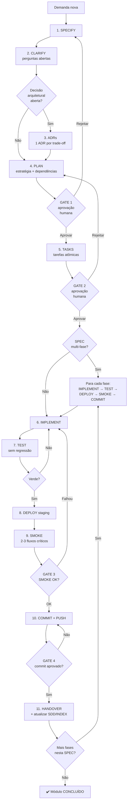

# SDD — método (referência)

> **Framework operacional, tool-neutral e stack-neutral** para desenvolvimento
> orientado por especificações. Ele funciona com colaboração humana e tambem
> com agentes de IA quando o projeto adota esse apoio.
>
> Lições reais (em projeto de produção) estão marcadas como `📚 LIÇÃO`.
>
> Fonte SDD original: https://codelabs.developers.google.com/sdd-adk-antigravity
> Getting Started: https://codelabs.developers.google.com/codelabs/getting-started-with-spec-driven-development-in-antigravity

---

## Sumário

1. [Fundamentos do SDD](#1-fundamentos-do-sdd)
2. [Modos de uso → artefatos obrigatórios](#2-modos-de-uso--artefatos-obrigatórios)
3. [Fase 0 — Setup do projeto](#3-fase-0--setup-do-projeto-uma-vez)
4. [Fase 1 — SPECIFY + CLARIFY](#4-fase-1--specify--clarify)
5. [Fase 2 — ADRs](#5-fase-2--adrs-decisões-arquiteturais)
6. [Fase 3 — PLAN](#6-fase-3--plan-estratégia-de-execução)
7. [Fase 4 — TASKS](#7-fase-4--tasks-decomposição-atômica)
8. [Fase 5 — IMPLEMENT](#8-fase-5--implement-com-sub-fases)
9. [Fase 6 — TEST](#9-fase-6--test)
10. [Fase 7 — RELEASE + SMOKE (GATE 3)](#10-fase-7--release--smoke-gate-3)
11. [Fase 8 — COMMIT + PUSH (GATE 4)](#11-fase-8--commit--push-gate-4)
12. [Fase 9 — HANDOVER](#12-fase-9--handover-entre-sessões)
13. [SPECs Multi-Fase](#13-specs-multi-fase-quando-e-como-quebrar)
14. [Skill, templates e pasta SDD/](#14-skill-templates-e-pasta-sdd)
15. [Lições aprendidas / Troubleshooting](#15-lições-aprendidas--troubleshooting)
16. [Adaptação a outras stacks](#16-adaptação-a-outras-stacks)
17. [FAQ](#17-faq)

---

## 1. Fundamentos do SDD

### 1.1 Princípios não-negociáveis

| Princípio | Significa |
|---|---|
| **Spec-first** | Nenhum código de produção é gerado sem o contrato do playbook (SPEC, story, ou nenhum em bug-fix). |
| **Gates humanos** | Quatro gates nomeados (PLAN, TASKS, SMOKE, COMMIT). Quais disparam é o **perfil** do playbook (ADR-002). |
| **Fonte primária** | Toda decisão técnica registra URL verificável. Sem URL → bloqueia. |
| **Backward-compat** | Cada commit preserva o estado funcional anterior. |
| **Rastreabilidade** | Código → Tarefa → SPEC → ADR (cadeia auditável). |
| **Reversibilidade** | Cada fase é revertível com `git revert` sem efeito cascata. |

### 1.2 Ciclo completo



### 1.3 Os 4 GATEs humanos e os perfis

Os quatro gates existem. O playbook em `.agent/skills/sdd-mode/playbooks/` declara um **perfil** (ADR-002). O agente não escolhe um perfil mais leve para pular PLAN.

| Perfil | Gates ativos | Código de produção | Exemplos |
|---|---|---|---|
| `observe` | nenhum | não | investigation, onboarding, discover até o brief |
| `design` | aprovação do artefato de design/protótipo | não | design, prototype |
| `lite` | G3, G4 | sim | bug-fix, refactor interno, story mínima |
| `standard` | G2, G3, G4 | sim | feature pequena, user-story |
| `full` | G1, G2, G3, G4 | sim | feature média/grande, bootstrap, refactor arquitetural |

| GATE | Quando | Quem aprova | Pode skipar? |
|---|---|---|---|
| **G1 — PLAN** | Após PLAN gerado, antes de TASKS | Dono do produto / arquiteto | Só se o perfil não inclui G1 |
| **G2 — TASKS** | Após TASKS, antes de IMPLEMENT | Dono do produto / dev sênior | Só se o perfil não inclui G2 |
| **G3 — SMOKE** | Após evidência na superfície real, antes de COMMIT | Dono do produto | Não, em qualquer perfil que gere código |
| **G4 — COMMIT** | Antes de `git push` para `main` | Dev (revisar diff) | Excepcional, com justificativa |

> 📚 LIÇÃO: G3 (SMOKE) é o gate mais negligenciado. Captura regressão de
> comportamento que nenhum unit test pega — ex.: prompt do LLM responde
> diferente após refatoração; mudança de CSS quebra responsividade no mobile;
> migração de DB altera precisão de timestamps. Suite verde não significa
> "está pronto".

---

## 2. Modos de uso → artefatos obrigatórios

Nem toda demanda exige o ciclo completo. Use esta tabela como guia rápido:

| Modo | SPEC nova? | ADR? | PLAN? | TASKS? | Handover? | Perfil | Playbook |
|---|---|---|---|---|---|---|---|
| **Investigation** | Não | Não | Não | Não | Não | `observe` | `investigation.md` |
| **Design** | Não (ainda) | Talvez depois | Não | Não | Opcional | `design` | `design.md` |
| **Prototype** | Não | Não | Não | Não | Nota | `design` | `prototype.md` |
| **User story** | Não (exige SPEC de módulo) | Se trade-off | Não | Se `standard` | Sim | `standard` ou `lite` | `user-story.md` |
| **Bug fix simples** | Não | Só se decisão | Não | Não | Opcional | `lite` | `bug-fix.md` |
| **Feature pequena** (≤100 LOC) | Estende existente | Se trade-off | Não | Sim (1 fase) | Sim | `standard` | `feature.md` |
| **Feature média** (100-400 LOC) | Sim | Provável | Sim | Sim | Sim | `full` | `feature.md` |
| **Feature grande** (>400 LOC) | Sim | Múltiplas | Sim, multi-fase | Sim, por fase | Por fase | `full` | `feature.md` + `multi-phase.md` |
| **Refator interno** (sem mudança contratual) | Não | Sim (justifica o por quê) | Não | Não | Sim | `lite` | `refactor.md` |
| **Refator arquitetural** (muda contrato) | Sim ("v2") | Sim (de migração) | Sim, multi-fase | Sim | Por fase | `full` | `refactor.md` |
| **TDD implement** | Herda | Herda | Herda | Herda | Se a sessão acaba | herda | `tdd-implement.md` |
| **Greenfield** (projeto novo) | Sim, todas | Várias | Sim por módulo | Sim por módulo | Sim por módulo | `full` | `bootstrap.md` |
| **Brownfield sem docs** | Adoção retroativa | Idem | — | — | Sim | `observe` | `discover.md` |

> 📚 LIÇÃO: A maior armadilha é forçar o ciclo completo num bug fix de 5 linhas
> ou num greenfield onde tudo ainda está em fluxo. Ajuste o ciclo ao escopo —
> a tabela acima é o filtro de bom senso.

### 2.1 Quando criar SPEC nova vs. estender existente

| Situação | Ação |
|---|---|
| Novo módulo independente | SPEC nova |
| Mudança ≤30% num módulo existente | Estender SPEC existente + ADR |
| Mudança >30% em existente | SPEC nova ("v2") + ADR de migração |
| Bug fix sem mudança de comportamento | Não precisa SPEC; só ADR se houver decisão |
| Refator interno sem mudança contratual | Não precisa SPEC |

---

## 3. Fase 0 — Setup do projeto (uma vez)

### 3.1 Estrutura mínima de diretórios

O processo do produto vive em `SDD/`, gerado por `sdd-mode` (ver `references/layout.md`).

```text
projeto/
├── README.md
├── .agent/skills/sdd-mode/
├── SDD/          ← brief, AGENTS, INDEX, modules, plans, decisions, handovers
├── app/ | src/
└── .gitignore
```

### 3.2 Setup de versionamento (faça antes de codar)

```bash
# 1. Inicializar repo LOCAL — nunca dentro de cloud-sync (Drive/OneDrive/Dropbox)
cd ~/dev    # ou C:\dev no Windows
git init -b main meu_projeto && cd meu_projeto

# 2. Identidade local (não global — evita poluir outros projetos)
git config --local user.name "<seu_user>"
git config --local user.email "<seu_user>@users.noreply.github.com"
git config --local core.autocrlf true   # Windows; "input" no Linux/Mac

# 3. .gitignore antes do primeiro commit (evita vazar .env)
# Mínimo: .env, .venv/, __pycache__/, *.json.key, service-account*.json,
#         credentials*.json, .DS_Store, node_modules/, dist/

# 4. Primeiro commit baseline
git add . && git commit -m "chore: initial commit — <descrição mínima>"

# 5. Repo remoto (privado por padrão se houver project IDs/secrets)
gh auth login   # browser flow, evita PAT
gh repo create <user>/<repo> --private --source . --push
```

> 📚 LIÇÃO: NUNCA inicializar `.git/` dentro de pasta sincronizada por
> Drive/OneDrive/Dropbox. O sync vai bloquear `.git/objects/` durante
> `git push` (até 5 min em vez de 3s) e pode corromper o índice.
> Mantenha `~/dev/` ou `C:\dev\` fora do sync; use o GitHub como backup.

### 3.3 Segredos e release (se aplicável)

SDD não escolhe cloud. Se o produto tiver deploy:

- secrets em env ou secret manager — nunca em git;
- tag imutável (commit SHA), não `:latest`;
- G3 é evidência na superfície real daquele alvo (URL, binário, CLI).

### 3.4 Arquivos obrigatórios da Fase 0

| Arquivo | Por quê | Sem ele |
|---|---|---|
| `SDD/` (gerada pelo modo) | Processo do produto | Cada sessão re-inventa artefatos |
| `SDD/AGENTS.md` | Constituição | Regras mudam a cada chat |
| `.gitignore` | Não vazar `.env` | Leak de secrets |

### 3.5 Configuração do ambiente de trabalho

O workflow SDD nao exige uma IDE, um terminal ou um agente especifico. Antes da
primeira sessao, o projeto deve definir apenas o minimo operacional:

| Decisao | Valor esperado |
|---|---|
| Workspace | Raiz real do projeto, fora de cloud-sync quando o Git local puder sofrer bloqueios |
| Fonte do metodo | `.agent/skills/sdd-mode/references/workflow.md` e artefatos SDD versionados |
| Contexto do projeto | `SDD/BRIEF.md`, `SDD/AGENTS.md`, INDEX e handovers |
| Planejamento | PLAN e TASKS revisaveis no repo, mesmo que a ferramenta tenha UI auxiliar |
| Validacao | comandos, checks ou criterios aplicaveis a esta stack |
| Gates | aprovacoes humanas preservadas no processo escolhido |

Se uma ferramenta oferecer modos de planejamento, regras locais, slash commands
ou arquivos proprios de instrucao, trate isso como apoio de execucao. A escolha
da ferramenta nao muda a ordem dos artefatos SDD.

### 3.6 Prompt de onboarding (1ª sessão de qualquer dev)

Use o playbook `onboarding.md`. Resumo:

```text
Antes de qualquer ação, leia e resuma:
1. SDD/AGENTS.md — constituição do produto
2. .agent/skills/sdd-mode/SKILL.md — procedimento
3. SDD/INDEX.md — módulos
4. SDD/architecture.md — se existir
5. SDD/handovers/ (mais recente)

Então responda em ordem:
a. Quais regras absolutas você está obrigado a seguir?
b. Quais versões estão fixadas e por quê?
c. Quais módulos já existem e qual seu status?
d. Há ADRs aceitos que afetam o trabalho de hoje?

Não escreva nenhum código nesta resposta.
```

---

## 4. Fase 1 — SPECIFY + CLARIFY

### 4.1 O que entra numa SPEC

Use `.agent/skills/sdd-mode/templates/spec.md`. Escreva em `SDD/modules/SPEC_<MODULO>.md`. Estrutura mínima:

```text
# SPEC_<MODULO>.md
**Status:** 📝 RASCUNHO

## 1. Objetivo
Frase única descrevendo o "porquê".

## 2. Contexto e Justificativa
Referências (URLs) ao Architecture, ADRs, regulamentação.

## 3. Design Técnico
Estruturas de dados, sequence diagrams, fluxos.

## 4. Regras de Negócio
| ID | Regra | Fonte |
|---|---|---|

## 5. Variáveis de Ambiente
| Nome | Default | Descrição |
|---|---|---|

## 6. Arquivos a Criar/Modificar
Lista com caminhos completos e função esperada.

## 7. Testes Requeridos
| ID | Tipo | Cobertura |
|---|---|---|

## 8. Critérios de Aceite (DoD)
Lista checável.

## 9. CLARIFY — perguntas abertas
Q1: ...

## 10. Histórico (opcional)
Decisões importantes durante CLARIFY.
```

### 4.2 Status de uma SPEC

| Símbolo | Significado | Próximo passo |
|---|---|---|
| 📝 RASCUNHO | Esqueleto criado | CLARIFY com humano |
| 🔍 CLARIFY | Perguntas abertas | Humano responde Q1..Qn |
| 📋 PLAN | Plano gerado | GATE 1 (aprovação humana) |
| ✅ APROVADO | PLAN+TASKS aprovados | IMPLEMENT começa |
| 🚧 IMPLEMENT | Em desenvolvimento | Sub-fases (se multi-fase) |
| ✔️ CONCLUÍDO | Smoke OK | Atualizar `SDD/INDEX.md` |

### 4.3 Prompt CLARIFY

```text
@pm Sobre SPEC_<MODULO>.md, responda às perguntas Q1..Qn da §9:

Q1: <pergunta>
Resposta: <decisão> — Fonte: <URL ou justificativa>

Q2: ...

Após responder:
1. Atualizar §10 (Histórico) com cada decisão e rationale
2. Remover Qs respondidas da §9
3. Promover status para 📋 PLAN se §9 ficar vazia
4. Identificar Qs que viraram trade-off arquitetural → propor ADR
```

---

## 5. Fase 2 — ADRs (decisões arquiteturais)

> 📚 LIÇÃO: A spec responde "o quê". A ADR responde "por que escolhemos X em
> vez de Y" para uma decisão com trade-off real. Ignorar ADRs faz toda decisão
> virar conhecimento tribal — quebra rastreabilidade.

### 5.1 Quando criar uma ADR

- CLARIFY revelou trade-off com 2+ alternativas viáveis.
- Decisão tem impacto financeiro (custo cloud, licença).
- Decisão tem impacto regulatório (LGPD, GDPR, HIPAA, PCI-DSS).
- Decisão será difícil de reverter depois (vendor lock-in, schema DB).
- Decisão contradiz uma "best practice" comum (precisa justificativa explícita).

### 5.2 Template ADR

Use `.agent/skills/sdd-mode/templates/adr.md`. Escreva em `SDD/decisions/`. Resumo:

```markdown
# ADR-NNN — <Decisão em uma frase>

**Status:** 📝 PROPOSTA | ✔️ ACEITO | ❌ REJEITADO | ⏸️ SUPERSEDED por ADR-MMM
**Data:** YYYY-MM-DD
**Autores:** <nomes>
**Spec relacionada:** SDD/modules/SPEC_<X>.md

## Contexto
Qual problema motiva a decisão? Quais restrições?

## Alternativas consideradas
### Opção A — <nome>
- Prós / Contras / Custo / Fonte (URL)

### Opção B — <nome>
... (mínimo 2 alternativas, idealmente 3)

## Decisão
Escolhemos a **Opção X** porque <justificativa em 2-4 linhas>.

## Consequências
- Positivas / Negativas (aceitas) / Riscos mitigados / Risco residual

## Como reverter
Passos práticos para sair desta decisão se ela falhar.
```

### 5.3 Padrão de numeração

- ADR-001 a ADR-099 reservados para o projeto base.
- ADR-100+ para evoluções de v2.
- **Nunca reutilizar número** mesmo se ADR for rejeitada (preserva histórico).

---

## 6. Fase 3 — PLAN (estratégia de execução)

### 6.1 O que entra num PLAN

Use `.agent/skills/sdd-mode/templates/plan.md`. Escreva em `SDD/plans/`. Resumo:

```text
# PLAN_<MODULO>.md
**Status:** 📋 PLAN (aguardando GATE 1)

## Resumo Executivo
2-3 parágrafos: escopo, abordagem, premissas.

## Tabela de Fases (se multi-fase — ver §13)
| Fase | Entrega | LOC est. | Risco | Gate |
|---|---|---|---|---|

## Mapa de Dependências (mermaid)

## Detalhe por Fase
Para cada fase: objetivo, arquivos, LOC, gate de aceite.

## Riscos e Mitigações
| ID | Risco | Probabilidade | Impacto | Mitigação |
|---|---|---|---|---|

## Métricas de Sucesso
Como saberemos que funcionou? (latência, custo, taxa de erro, etc).

## Checklist Pré-IMPLEMENT
- [ ] STATIC_BLOCK / contratos imutáveis aprovados
- [ ] ADRs aceitos
- [ ] PLAN aprovado (GATE 1)
- [ ] TASKS aprovada (GATE 2)
- [ ] Dependências externas / secrets prontos (se o PLAN exigir)
```

### 6.2 Prompt para gerar PLAN

```text
Com base em SPEC_<X>.md (status PLAN) e ADRs <NNN>, gere
SDD/plans/PLAN_<X>.md como artefato.

Requisitos:
1. Se LOC estimado >800 OU >5 arquivos novos OU >2 serviços externos:
   quebrar em N fases (ver §13 do SDD_WORKFLOW)
2. Cada fase ≤250 LOC reais (regra de PR review)
3. Cada fase deve preservar baseline funcional
4. Mapa de dependências em mermaid
5. Riscos com mitigação concreta (não "monitorar")
6. Checklist pré-IMPLEMENT explícito

NÃO gere TASKS ainda. NÃO escreva código. Aguarde GATE 1.
```

> **GATE 1:** Humano aprova o PLAN (revisar fases, dependências, riscos).
> Rejeição → volta para SPECIFY/CLARIFY.

---

## 7. Fase 4 — TASKS (decomposição atômica)

### 7.1 O que entra num TASKS

Use `.agent/skills/sdd-mode/templates/tasks.md`. Escreva em `SDD/plans/`. Resumo:

```text
# TASKS_<MODULO>.md
**Status:** 📝 TASKS (aguardando GATE 2)

## Convenções
- T-XX é o ID estável da tarefa. NUNCA renumerar.
- [arquivo:função] indica destino. → NOVO cria; → MOD modifica.
- AC = critério de aceite verificável (teste ou comando).
- Tarefas [bloq.] impedem início da próxima fase.

## Fase A — <nome> (~LOC LOC, 1 PR)

| ID | Tarefa | Onde | AC |
|---|---|---|---|
| T-A1 | ... | `<src>/…` → MOD | check do AC verde |
| T-A2 | ... | ... | ... |
| T-A9 [bloq.] | testes full sem regressão | terminal | 0 falhas |
| T-A10 [bloq.] | smoke staging | manual | 3 fluxos críticos OK |
| T-A11 | commit + push | git | feat(<modulo>): fase A |
```

### 7.2 Convenções obrigatórias

- Prefixo `T-<FASE><N>` (T-A1, T-B2, T-C1.3 quando há sub-fase).
- IDs **nunca mudam** (auditoria + referência cruzada com handover).
- Se uma task é cancelada → marcar `~~T-A4~~` (riscado), não deletar.
- Se aparecem novas tasks no meio → continuar numeração (T-A12, T-A13).

### 7.3 Prompt para gerar TASKS

```text
PLAN aprovado (GATE 1). Gere SDD/plans/TASKS_<X>.md como artefato.

Requisitos:
1. 1 linha por tarefa atômica (1 commit lógico, ~10-30 LOC cada)
2. Cada tarefa tem AC verificável (teste, comando, HTTP, log)
3. Marcar tarefas [bloq.] que impedem próxima fase
4. Última tarefa de cada fase = commit (Conventional Commits)
5. Penúltima tarefa de cada fase = smoke staging (gate humano)
6. Antepenúltima = testes full sem regressão

NÃO escreva código. Aguarde GATE 2.
```

> **GATE 2:** Humano aprova a TASKS. Rejeição → volta para PLAN.

---

## 8. Fase 5 — IMPLEMENT (com sub-fases)

### 8.1 Loop por tarefa

Para cada `T-XN` numa fase:

```text
1. Confirmar pré-condições da tarefa (T-XN-1 verde, ADR aceita, etc).
2. Codar APENAS o escopo da tarefa — não antecipar próxima.
3. Rodar AC local imediatamente.
4. Rodar lint/typecheck nos arquivos editados.
5. Marcar T-XN como concluida no tracking adotado pelo projeto.
6. Próxima tarefa (não acumular várias sem AC verde).
```

### 8.2 Loop por fase (multi-fase)

```text
Para cada Fase F na SPEC:
1. Executar T-F1..T-F<N-3> (código + testes unitários).
2. T-F<N-2>: testes full → 0 regressão. [bloq.]
3. T-F<N-1>: deploy staging + smoke manual. [bloq. — GATE 3 humano]
4. T-F<N>: commit + push + atualizar `SDD/INDEX.md`. [GATE 4]
5. Handover: `SDD/handovers/handover_<MODULO>_FASE_<F>_<DATA>.md`
6. Próxima fase só começa após GATE 4 da anterior.
```

### 8.3 Regras absolutas durante IMPLEMENT

| Regra | Por quê |
|---|---|
| Sem dump de debug em produção | Telemetria segue `SDD/AGENTS.md` |
| Sem hardcode de credenciais | env / secret manager |
| Tipos e contratos públicos explícitos | Conforme a stack do produto |
| Arquivo ≤300 linhas / função ≤30 | Separação de responsabilidades |
| Comentário só no *por quê* | O código já diz o *quê* |

### 8.4 Quando voltar ao planejamento

Pare a implementacao e retorne para PLAN, CLARIFY ou ADR quando:

| Sinal | Acao |
|---|---|
| Apareceu trade-off arquitetural nao previsto | registrar decisao antes de continuar |
| A tarefa passou a tocar areas fora do plano | revisar escopo e dependencias |
| O bug exige investigacao sistematica | isolar causa e atualizar criterio de aceite |
| A demanda virou apenas explicacao ou descoberta | responder sem editar o projeto |
| O plano ficou claro novamente | voltar para a proxima task aprovada |

---

## 9. Fase 6 — TEST

### 9.1 Hierarquia de testes

| Tipo | Quando roda | Cobertura | Tempo total |
|---|---|---|---|
| **Unit** | A cada save (watch mode) | ≥80% código novo | <30s |
| **Integration** | A cada commit | Fluxo crítico cross-module | <5min |
| **Smoke** | Após deploy | 2-3 fluxos end-to-end | manual |
| **Load** | Pré-prod (opcional MVP) | RN de performance | varia |

### 9.2 Regras

- Mock 100% de I/O externo no unit (DB, HTTP, LLM, filesystem).
- Cliente real **só em smoke** (custo previsível).
- Nomenclatura: `test_<funcao>_<cenario>_<resultado_esperado>`.
- 1 assert por teste sempre que possível (debug rápido).
- Fixtures no lugar que a stack do produto já usa.

### 9.3 Pedido ao @qa

Gerar testes cobrindo a SPEC §7, no runner do projeto. Mock de I/O no unit. Nomes autoexplicativos. Sem prints. Default IMPLEMENT: skill `sdd-tdd` (RED → GREEN).

---

## 10. Fase 7 — RELEASE + SMOKE (GATE 3)

### 10.1 Princípio

Build com identificador imutável → publicar no alvo (staging, preview, binário, CLI) → health/smoke. O comando é o da stack do produto.

### 10.2 Smoke — checklist mínimo (humano)

```text
Alvo: <URL | binário | CLI>

[ ] Fluxo crítico 1
[ ] Fluxo crítico 2
[ ] Fluxo crítico 3 (se houver)
[ ] Sem erro novo nos logs do alvo
```

### 10.3 GATE 3

- Fluxos críticos da SPEC/story passam na superfície real.
- UX observável não regrediu.
- Suite verde não substitui este gate.

---

## 11. Fase 8 — COMMIT + PUSH (GATE 4)

### 11.1 Conventional Commits — formato obrigatório

```text
<tipo>(<escopo>): <título imperativo, ≤72 chars>

<corpo opcional explicando o "por quê", não o "o quê">

<footer opcional: refs, breaking changes>
```

### 11.2 Tipos válidos

| Tipo | Quando |
|---|---|
| `feat` | Funcionalidade nova visível ao usuário |
| `fix` | Correção de bug |
| `refactor` | Mudança interna sem alterar comportamento |
| `docs` | Só documentação (.md, docstrings) |
| `test` | Adicionar/ajustar testes sem mudar código |
| `chore` | Manutenção (dependências, gitignore, build) |
| `perf` | Melhoria de performance |
| `revert` | Reverter commit anterior |

### 11.3 Regras de tamanho de PR

| Tipo de mudança | LOC máximo no diff |
|---|---|
| `feat` numa fase | ≤250 |
| `fix` | ≤100 |
| `refactor` | ≤200 (separar do feat) |
| `chore` (deps) | sem limite |
| `docs` | sem limite |

### 11.4 Sequência segura de commit

```bash
# 1. Auditoria pré-commit
git status
git diff
git diff --check                 # detecta whitespace problemático
rg "TODO|FIXME|XXX" -- $(git diff --cached --name-only)   # itens pendentes

# 2. Confirmar que .env não foi staged
git diff --cached --name-only | grep -E "(^\.env$|credentials\.json|\.key$)" && \
  echo "ABORT: secret detectado!" && exit 1

# 3. Commit (HEREDOC para multi-linha)
git commit -m "$(cat <<'EOF'
feat(<modulo>): <título imperativo>

Implementa T-<X>1..T-<X>11 do PLAN_<MODULO> Fase <X>. <Por quê em 1-2 linhas>.
EOF
)"

# 4. Push (manual após GATE 4 — humano confirma diff no GitHub)
git push origin main
```

> **GATE 4:** Dev revisa o diff no GitHub UI antes de mergear/fechar.
> Em projetos solo, esse gate vira self-review obrigatório.

### 11.5 Quando NÃO commitar

- Pre-commit hook auto-formatou e os testes não rodaram de novo após format.
- `git status` mostra arquivos não relacionados à tarefa atual.
- Existe `.env`, `*.key`, `service-account*.json` no diff.
- Mensagem de commit não cita SPEC/ADR/TASK ID.

---

## 12. Fase 9 — HANDOVER (entre sessões)

> 📚 LIÇÃO: Sessão de IA tem contexto limitado. Sem handover, próxima sessão
> re-descobre estado e ADRs já decididas, gerando 30-60 min de "redescoberta".
> Handover bem feito = retomada em <2 min.

### 12.1 Convenção de nomes

| Caso | Nome do handover |
|---|---|
| Módulo standalone (1 fase) | `SDD/handovers/handover_<MODULO>_<DATA>.md` |
| Módulo multi-fase | `SDD/handovers/handover_<MODULO>_FASE_<X>_<DATA>.md` |
| Sessão de deploy/operação | `SDD/handovers/handover_<OPERACAO>_<DATA>.md` |
| Bootstrap inicial (DISCOVER) | `SDD/handovers/handover_DISCOVERY_<DATA>.md` |

### 12.2 Template de handover

Use `.agent/skills/sdd-mode/templates/handover.md`. Resumo:

```markdown
# Handover — <MODULO> Fase <X> (se aplicável)
**Data:** YYYY-MM-DD
**Status:** ✔️ FASE CONCLUÍDA | 🚧 EM ANDAMENTO | ❌ BLOQUEADA

## 1. O Que Esta Sessão Entregou
1-2 parágrafos descrevendo escopo concreto.

## 2. Tarefas Concluídas
| ID | Tarefa | Resultado |
|---|---|---|

## 3. Métricas Entregues vs. Estimadas
| Métrica | Estimado | Real | Δ |
|---|---|---|---|

## 4. Estado da Infra
Alvo de release (se houver), repositório (commit hash, branch).

## 5. Decisões Reafirmadas
ADRs validadas na prática + mudanças importantes de comportamento.

## 6. Pendências (não bloqueiam próxima fase)
Cleanup + operacional.

## 7. Próximos Passos
| Item | Detalhe |

## 8. Como Retomar
Próxima sessão: playbook `resume.md`.
```

### 12.3 Quando criar handover

- **Sempre** ao fechar uma fase (mesmo dentro do mesmo dia).
- **Sempre** ao encerrar uma sessão > 30 min.
- **Sempre** após deploy + smoke (mesmo se a fase não fechou).
- **Não precisa** entre tarefas pequenas dentro da mesma fase.

### 12.4 Prompt de encerramento

Use o playbook `handover.md`. Atualizar `SDD/INDEX.md`. Não commitar até revisão humana.

---

## 13. SPECs Multi-Fase: quando e como quebrar

> 📚 LIÇÃO: PRs >400 LOC têm taxa de bug 2-3x maior que ≤250 LOC.
> Quebrar uma SPEC grande em fases menores é prevenção de defeitos,
> não burocracia.

### 13.1 Critérios para quebrar SPEC em N fases

Quebre **se qualquer dos critérios for verdadeiro**:

| Critério | Limite |
|---|---|
| LOC total estimado | > 800 |
| Arquivos novos | > 5 |
| Serviços externos novos | ≥ 2 |
| Mudança em arquivo crítico (orchestrator, auth) | sempre |
| ADRs envolvidos | ≥ 3 |

### 13.2 Como quebrar (heurística)

1. **Identifique a árvore de dependências** (mermaid no PLAN).
2. **Cada fase entrega valor sozinha**: o sistema continua funcionando ao final.
3. **Cada fase ≤250 LOC**.
4. **Mocks/stubs são primeira-classe**: Fase B pode usar `global` em DB antes
   de Fase C trazer dados reais externos.
5. **Backward-compat por fase**: revert de Fase X não derruba Fase X-1.
6. **Idempotência**: rodar a mesma fase 2x não quebra (importante para retry).

### 13.3 Anatomia de uma fase de SPEC multi-fase

```text
Fase X
├─ Tarefas de código (T-X1..T-X<N-3>)
├─ Tarefa de testes full (T-X<N-2>) [bloq.]
├─ Tarefa de smoke staging (T-X<N-1>) [bloq. — GATE 3]
└─ Tarefa de commit + push (T-X<N>) [GATE 4]
   └─ Handover de fase
```

### 13.4 Anti-padrões em multi-fase

- ❌ "Fase final" que junta deploy + cleanup + observability + smoke.
- ❌ Fase que toca >5 módulos diferentes (sinal de SPEC mal recortada).
- ❌ Fase sem teste novo (mudança sem cobertura).
- ❌ Fase que não preserva baseline funcional.
- ❌ Renumerar tasks após começar (T-A4 vira T-A3).

---

## 14. Skill, templates e pasta SDD/

O procedimento vive em `.agent/skills/sdd-mode/`. Artefatos do **produto** nascem em `SDD/` (ver `references/layout.md`). Templates: `.agent/skills/sdd-mode/templates/`. Invocar `sdd-mode`; o playbook copia os passos. Sem `prompts/` paralelos.

---

## 15. Lições aprendidas / Troubleshooting

### 15.1 Workspace e versionamento

| Sintoma | Causa | Solução |
|---|---|---|
| `git push` demora >1 min | Repo dentro de Drive/OneDrive sync | Mover para `~/dev/` ou `C:\dev\` |
| `git init` demora >5s | Mesma causa | Mesma solução |
| `.git/index` corrompido | Cloud-sync escreveu parcialmente | Re-clonar do GitHub, copiar `.env` separado |
| `LF will be replaced by CRLF` warnings | Windows + `core.autocrlf=true` | Esperado, ignorar |

### 15.2 Release

| Sintoma | Causa | Solução |
|---|---|---|
| Artefato não muda no alvo | Tag mutável (`:latest`) | Tag = SHA do commit |
| Build envia lixo | Ignore de build ausente | Excluir `.git/`, deps, caches |

### 15.3 IDE / Agent

| Sintoma | Causa | Solução |
|---|---|---|
| Agente perde contexto mid-tarefa | Sessão muito longa | Handover; playbook `resume.md` |
| Agente "esquece" regras | `SDD/AGENTS.md` não foi lido | Playbook `onboarding.md` |
| Agente edita arquivo errado | Workspace incorreto | Confirmar workspace antes de qualquer edit |
| Auto-continue avança sem aprovar | Faltou marcar `[bloq.]` na TASKS | Reforçar gates humanos no prompt |

### 15.4 Git / GitHub

| Sintoma | Causa | Solução |
|---|---|---|
| `gh auth login` trava | Browser não abriu | Usar `--web` e copiar code manual em `github.com/login/device` |
| Push rejeitado | Histórico divergente | `git pull --rebase origin main` e resolver conflitos |
| `.env` foi commitado | `.gitignore` faltando | `git rm --cached .env`, commit, **rotacionar todas as keys** |

### 15.5 Testes

| Sintoma | Causa | Solução |
|---|---|---|
| Smoke OK mas usuário reclama | Comportamento de UX não testado por unit | Adicionar smoke check ao GATE 3 |
| Suite verde + UX errada | Faltou G3 na superfície real | Smoke dos fluxos da SPEC |
| Teste flake | I/O real ou relógio | Mock; tempo determinístico |

---

## 16. Adaptação a outras stacks

### 16.1 Estrutura mínima reutilizável

| Arquivo / Pasta | Portável? | O que adaptar |
|---|---|---|
| `SDD/AGENTS.md` | Sim | Stack e regras do produto |
| `.agent/skills/sdd-mode/` | Sim | Copiar o pack; não reescrever o método |
| `.agent/skills/<dominio>/SKILL.md` | Não | Criar SKILLs por domínio do novo projeto |
| `.agent/agents.md` (personas) | **Sim, idêntico** | Mesmas 4 personas: @pm, @engineer, @qa, @devops |
| `SDD/INDEX.md` (template) | Sim | Lista de módulos do novo projeto |
| `SDD/modules/SPEC_*.md` | Não | Criar SPECs do novo projeto |
| `SDD/decisions/ADR-*.md` | Não | Criar ADRs do novo projeto |
| `.agent/skills/sdd-mode/references/workflow.md` | **Sim — usar este arquivo** | Ajustar exemplos de comando à stack |
| `SDD/architecture.md` | Não | Escrever para o novo projeto |
| `.gitignore`, ignores de build/deploy | Sim | Ajustar ao projeto e ao alvo de release |
| Dependency manifest | Não | Dependências do novo projeto |

### 16.2 Ajustes por stack

#### Python (FastAPI / Django / Flask)

- Use `pytest + pytest-asyncio` para testes.
- `requirements.txt` com versões fixadas (pinned).
- `pyproject.toml` se preferir Poetry / uv / hatch.
- Type hints obrigatórios → ative `mypy` ou `pyright` no CI.

#### Node (Express / Fastify / NestJS / Next.js)

- Use `jest + ts-jest` ou `vitest`.
- `package.json` com versões pinned (não `^` em produção).
- Lockfile (`package-lock.json` / `pnpm-lock.yaml` / `yarn.lock`) sempre commitado.
- TypeScript estrito (`"strict": true` no `tsconfig.json`).

#### Go (net/http / Gin / Fiber / Echo)

- Use `go test` + `testify`.
- `go.mod` + `go.sum` commitados.
- `golangci-lint` no CI.
- Generics + interfaces nativas substituem necessidade de DI complexa.

#### Rust (Axum / Actix / Rocket)

- `cargo test` para unit.
- `Cargo.toml` + `Cargo.lock` commitados.
- `clippy` + `rustfmt` no CI.
- Tipos de erro robustos via `thiserror` / `anyhow`.

#### Infra

O SDD não fixa provider. Registre build/deploy/secrets em `SDD/AGENTS.md` e, se houver trade-off, numa ADR.

### 16.3 Atalhos de execucao opcionais

Ferramentas diferentes podem oferecer modos, comandos curtos, workflows ou
automacoes para planejar, testar, depurar e publicar. Use esses atalhos quando
eles preservarem os artefatos e gates do SDD.

No caminho principal, os equivalentes portaveis sao:

| Necessidade | Artefato ou acao SDD |
|---|---|
| Planejar | `PLAN_<MODULO>.md` |
| Decompor trabalho | `TASKS_<MODULO>.md` |
| Investigar bug | playbook `bug-fix.md` |
| Validar | suite do projeto + G3 |
| Retomar sessao | handover + playbook `resume.md` |

### 16.4 Dicas criticas de operacao

- **Git entre rodadas (obrigatório):** stage as mudanças antes de cada nova rodada do agente. Diff visível = controle.
- **Um plano por vez:** múltiplos planos concorrentes confundem o agente.
- **Aprovação explícita antes de IMPLEMENT** mesmo com auto-continue ativo:

```text
Não escreva código ainda. Aguarde minha aprovação do PLAN e da TASKS.
```

---

## 17. FAQ

### "Preciso seguir todas as 9 fases pra um bug fix de 5 linhas?"

Não. Veja §2 (Modos de uso). Bug fix simples passa direto para IMPLEMENT, com gates G3 e G4. SPECs e PLANs são para mudanças com escopo significativo.

### "E se o projeto não tem cloud, é só CLI/desktop?"

Adapte: Fase 7 (DEPLOY) vira "build do binário/release". Smoke é "rodar o binário em ambiente similar ao usuário e validar 2-3 fluxos críticos". Princípio é o mesmo: sempre haja um gate humano antes do release.

### "Como adoto SDD num projeto que já existe e não tem nada disso?"

Playbook `discover.md`. O agente explora o código; você confirma os `[?]` no `SDD/BRIEF.md`.

### "Posso pular o GATE 4 (revisão de commit) se trabalho sozinho?"

Não recomendado. Em projetos solo, o GATE 4 vira self-review obrigatório — você revisa o diff no GitHub UI antes de mergear/fechar. Esse hábito captura coisas que escapam mid-flow.

### "ADR ou SPEC, qual primeiro?"

SPEC primeiro (responde "o quê"). Se durante CLARIFY surge trade-off arquitetural com 2+ alternativas viáveis, então ADR (responde "por quê escolhemos X em vez de Y"). ADR sem SPEC não faz sentido — fica orfã.

### "Quantas ADRs por SPEC?"

Não há regra fixa. Em projeto típico: 0-3 ADRs por SPEC. Se passar de 3, considere quebrar a SPEC em duas (sinal de escopo grande demais).

### "O agente reabre debate de ADR já fechada. Como evito?"

ADRs em `SDD/decisions/` com `✔️ ACEITO`, listadas em `SDD/INDEX.md`. No `resume.md`: "ADRs aceitos: … — não reabrir."

### "Qual a relação entre SDD e TDD?"

Complementares. A SPEC §7 nomeia os testes; `sdd-tdd` os escreve em RED → GREEN quando o caminho local for barato.

### "E se o agente entra em loop ou fica preso?"

Handover (mesmo parcial) e sessão nova com playbook `resume.md`.

---

*Versão 2.1 — método na skill; processo do produto em `SDD/`. Sincronizar com `SDD/INDEX.md`.*
