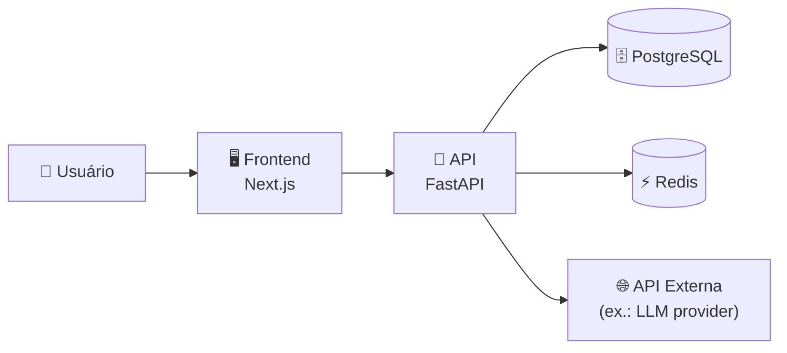
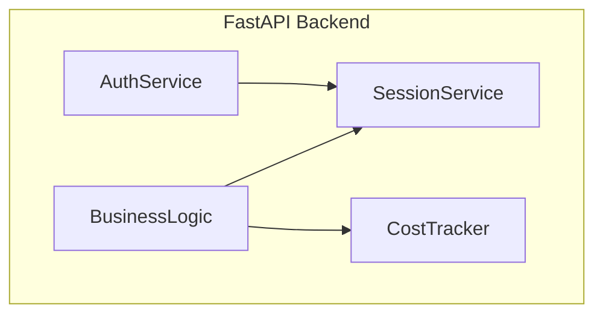
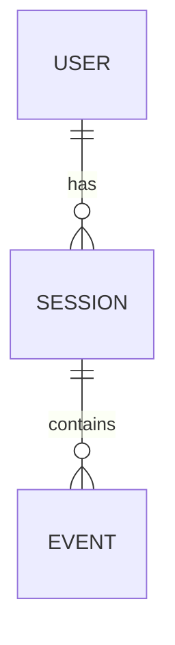

<!--
═══════════════════════════════════════════════════════════════════════════════
  Template de Architecture Document
═══════════════════════════════════════════════════════════════════════════════

  Como usar:
  1. Copie para SDD/architecture.md
  2. Este é o documento de referência técnica do projeto inteiro
  3. Atualize quando mudanças arquiteturais (não funcionais) ocorrerem
  4. Cada SPEC referencia uma seção deste documento

  Diferença de outros artefatos:
  - AGENTS.md: regras (o que NÃO fazer)
  - SPEC: contrato funcional de UM módulo (o que ele faz)
  - ADR: decisão única com trade-off (por quê escolhemos X)
  - ARCHITECTURE: visão técnica COMPLETA do sistema (como tudo se encaixa)
═══════════════════════════════════════════════════════════════════════════════
-->

# <NOME_PROJETO> — Documento de Arquitetura

**Versão:** 1.0
**Última atualização:** YYYY-MM-DD
**Mantenedor:** <nome>

---

## Sumário

1. [Visão Geral](#1-visão-geral)
2. [Princípios Arquiteturais](#2-princípios-arquiteturais)
3. [Stack Técnica](#3-stack-técnica)
4. [Diagrama de Sistemas](#4-diagrama-de-sistemas)
5. [Módulos](#5-módulos)
6. [Dados e Persistência](#6-dados-e-persistência)
7. [Autenticação e Autorização](#7-autenticação-e-autorização)
8. [Observabilidade](#8-observabilidade)
9. [Segurança](#9-segurança)
10. [Performance e Escala](#10-performance-e-escala)
11. [Deploy e Infra](#11-deploy-e-infra)
12. [Custo Operacional](#12-custo-operacional)
13. [Limitações Conhecidas](#13-limitações-conhecidas)
14. [Roadmap Técnico](#14-roadmap-técnico)
15. [Glossário](#15-glossário)

---

## 1. Visão Geral

### 1.1 O que o projeto faz
<2-3 parágrafos: objetivo de negócio, usuário-alvo, problema que resolve.>

### 1.2 Estágio atual
<Greenfield / MVP / Beta / Produção — incluir métricas atuais.>

### 1.3 Não faz (escopo fora)
- ❌ <funcionalidade fora do escopo>
- ❌ <funcionalidade fora do escopo>

---

## 2. Princípios Arquiteturais

> Trade-offs explícitos que guiam todas as decisões técnicas. Toda ADR deve
> referenciar pelo menos um princípio.

| ID | Princípio | Implica |
|---|---|---|
| P-01 | <ex.: "Backend stateless"> | <ex.: "Sessão persistida em DB, não em memória"> |
| P-02 | <princípio> | <implicação prática> |

---

## 3. Stack Técnica

| Camada | Tecnologia | Versão | Justificativa |
|---|---|---|---|
| Linguagem backend | <ex.: Python> | 3.11.x | <razão>; ADR-NNN |
| Framework web | <ex.: FastAPI> | >=0.115 | <razão> |
| Banco principal | <ex.: PostgreSQL> | 16.x | <razão> |
| Cache | <ex.: Redis> | 7.x | <razão> |
| Filas | <ex.: Pub/Sub> | — | <razão> |
| Frontend | <ex.: Next.js> | 14.x | <razão> |
| Infra | <ex.: GCP Cloud Run> | — | ADR-MMM |
| CI/CD | <ex.: GitHub Actions> | — | <razão> |

---

## 4. Diagrama de Sistemas

### 4.1 Visão alto-nível (C4 - Context)



### 4.2 Componentes internos (C4 - Container)



---

## 5. Módulos

> Cada módulo tem uma SPEC. Tabela mantida em sincronia com `SDD/INDEX.md`.

| Módulo | Responsabilidade | SPEC | Status |
|---|---|---|---|
| Auth | OAuth + sessão | `SDD/modules/SPEC_AUTH.md` | <status> |
| Sessions | Gestão de sessão | `SDD/modules/SPEC_SESSIONS.md` | <status> |
| <módulo> | <responsabilidade> | <spec> | <status> |

---

## 6. Dados e Persistência

### 6.1 Modelo de dados



### 6.2 Estratégia de migração
<Como evoluímos schema sem downtime? (ex.: Alembic, expand-contract, ...)>

### 6.3 Backup e retenção
- Backup: <frequência, ferramenta, destino>
- Retenção: <período por tipo de dado, regulação aplicável>

### 6.4 LGPD/GDPR
- Direito de acesso: <implementado em endpoint X>
- Direito de erasure: <implementado em endpoint Y>
- Anonymização: <campos anonimizados após N dias>

---

## 7. Autenticação e Autorização

- **Provedor de identidade:** <ex.: Google OAuth via Firebase Auth>
- **Sessão:** <strategy — JWT / cookie / DB-backed>
- **TTL:** <duração>
- **Allowlist (se single-tenant):** ADR-NNN
- **MFA:** <suportado? como?>

---

## 8. Observabilidade

| Tipo | Ferramenta | O que captura |
|---|---|---|
| Logs | <ex.: Cloud Logging> | Estruturados, sem dados sensíveis |
| Métricas | <ex.: Cloud Monitoring> | Latência, taxa de erro, custo |
| Traces | <ex.: Cloud Trace> | Cross-service calls |
| Alertas | <ex.: PagerDuty / email> | Erro >0.1% por 5 min, custo >budget |

---

## 9. Segurança

### 9.1 Modelo de ameaça (resumo STRIDE)

| Ameaça | Mitigação |
|---|---|
| Spoofing | OAuth + verificação de token a cada request |
| Tampering | TLS obrigatório + integridade via hash |
| Repudiation | Audit log com user ID em toda mutação |
| Information Disclosure | Logs sem PII; DB encrypted at rest |
| Denial of Service | Rate limiting + Cloud Armor |
| Elevation of Privilege | RBAC + least-privilege em todas service accounts |

### 9.2 Secrets management
<Onde estão os secrets? Como rotacionamos?>

### 9.3 Vulnerability management
<Dependabot / Renovate? Schedule de patches?>

---

## 10. Performance e Escala

| Métrica | Target | Atual |
|---|---|---|
| p50 latência | <Xms | <atual> |
| p95 latência | <Yms | <atual> |
| p99 latência | <Zms | <atual> |
| Throughput | <N req/s> | <atual> |
| Concurrent users | <N> | <atual> |

### 10.1 Estratégia de escala
- **Horizontal:** <auto-scaling? min/max instances?>
- **Vertical:** <CPU/RAM por instância>
- **Cache:** <hit rate alvo, eviction policy>

---

## 11. Deploy e Infra

### 11.1 Ambientes
| Ambiente | URL | Propósito |
|---|---|---|
| Local | http://localhost:8000 | Dev |
| Staging | <url> | Smoke tests, GATE 3 |
| Produção | <url> | Live traffic |

### 11.2 Pipeline CI/CD
```
PR aberto → CI (lint + test) → review.md + pacote humano → merge da branch →
deploy em staging → smoke (GATE 3) →
promote para produção (após pacote) → smoke produção
```

### 11.3 Rollback
<Como revertemos um deploy? Tempo médio?>

---

## 12. Custo Operacional

| Componente | Custo mensal estimado | Driver |
|---|---|---|
| Compute (Cloud Run) | $<X> | <N> instâncias × <horas> × <preço/h> |
| DB (PostgreSQL) | $<X> | <tier> |
| Storage | $<X> | <GB armazenados> |
| LLM API | $<X> | <N> chamadas/dia × <preço/chamada> |
| **TOTAL** | **$<X>** | |

Budget alert configurado em <% do total>.

---

## 13. Limitações Conhecidas

- <limitação técnica atual>: ADR-NNN explica o trade-off
- <limitação>: solução em backlog (ver §14)

---

## 14. Roadmap Técnico

| Período | Prioridade | Item | Trigger |
|---|---|---|---|
| Q1 2026 | Alta | <item> | <quando começar> |
| Q2 2026 | Média | <item> | <quando começar> |

---

## 15. Glossário

| Termo | Significado |
|---|---|
| <termo> | <definição clara em 1 linha> |

---

*Manter sincronizado com `SDD/INDEX.md` e `AGENTS.md`.*
