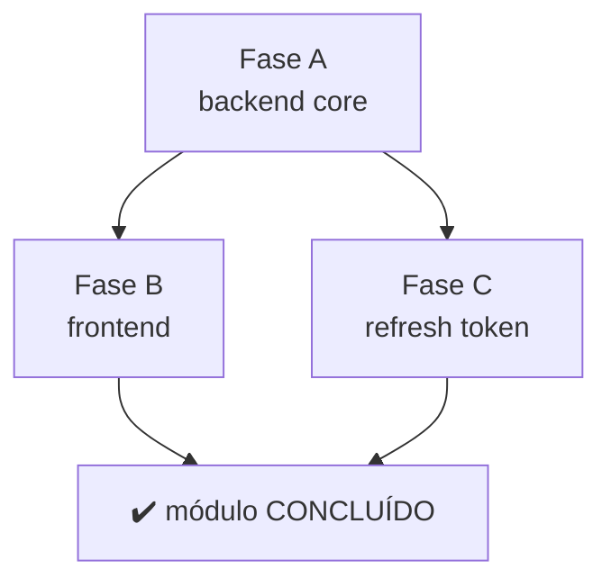

<!--
═══════════════════════════════════════════════════════════════════════════════
  Template de PLAN (Implementation Plan) de módulo
═══════════════════════════════════════════════════════════════════════════════

  Como usar:
  1. Copie para SDD/plans/PLAN_<MODULO>.md
  2. Pré-requisito: SPEC_<MODULO>.md tem status 📋 PLAN (CLARIFY resolvido)
  3. Use os critérios da §13 do SDD_WORKFLOW para decidir multi-fase
  4. Aguarde GATE 1 (humano aprova PLAN) antes de gerar TASKS

  ⚠️  NUNCA escrever código nesta fase. PLAN é só estratégia.
═══════════════════════════════════════════════════════════════════════════════
-->

# PLAN_<MODULO> — Plano de Implementação

**Status:** 📋 PLAN (aguardando GATE 1)
**Autor:** <nome>
**Data:** YYYY-MM-DD
**Spec base:** `SDD/modules/SPEC_<MODULO>.md`
**ADRs aplicáveis:** ADR-NNN, ADR-MMM

---

## Resumo Executivo

> 2-3 parágrafos explicando o escopo, a abordagem geral e premissas adotadas.

<!-- Exemplo:
Implementar autenticação OAuth via Google em 3 fases. Fase A: backend (provider
+ middleware + endpoints). Fase B: frontend (botão de login + callback handler).
Fase C: refresh token automático.

Premissa: usar biblioteca `google-auth-oauthlib` (≥1.0.0) por ter integração
nativa com Google Identity Platform. Não implementar do zero (decisão em ADR-007).

Trade-off aceito: latência de ~300ms no primeiro login (callback OAuth) — dentro
do RN-AUTH-03 (≤500ms p95).
-->

---

## Tabela de Fases (se multi-fase)

> Apenas se SPEC for multi-fase. Critérios em SDD_WORKFLOW §13.1.

| Fase | Entrega | LOC est. | Risco | Gate de aceite |
|---|---|---|---|---|
| **A** | <descrição da fase> | ~XXX | Baixo | Smoke fluxo crítico #1 OK |
| **B** | <descrição> | ~XXX | Médio | Integration tests verdes |
| **C** | <descrição> | ~XXX | Alto | Smoke E2E completo |

---

## Mapa de Dependências

---

## Detalhe por Fase

### Fase A — <nome>

**Objetivo:** <frase única>

**Arquivos:**
- `<src>/<modulo>/...` → NOVO (descricao)
- `<arquivo-existente>` → MOD (ponto de integracao)

**LOC estimado:** ~XXX

**Pré-condições:**
- ADR-NNN aceito
- Dependencias e configuracoes necessarias prontas
- Decisoes de dados, release ou integracao resolvidas quando aplicavel

**Gate de aceite:**
- Todos os testes unit da §7 da SPEC verdes
- Smoke do fluxo critico #1 OK no alvo aplicavel
- Sinais de erro relevantes revisados

### Fase B — <nome>

(Mesma estrutura)

### Fase C — <nome>

(Mesma estrutura)

---

## Riscos e Mitigações

> Não escrever "monitorar" como mitigação. Mitigação concreta = ação verificável.

| ID | Risco | Probabilidade | Impacto | Mitigação |
|---|---|---|---|---|
| R1 | API externa instável (5xx > 1%) | Média | Alto | Retry com exponential backoff (3x, max 5s); fallback para cache local |
| R2 | Cold start > 3s no primeiro login | Alta | Médio | Pre-warm com cron 5min; aceitar trade-off (custo ≤$2/mês) |
| R3 | Vazamento de token em log | Baixa | Alto | Pre-commit hook + filtro no logger estruturado |

---

## Métricas de Sucesso

> Como saberemos que o módulo funciona? Números, não adjetivos.

- **Funcional:** 100% dos critérios de aceite da SPEC §8
- **Performance:** p95 < <X>ms no fluxo crítico
- **Custo:** < $<Y>/mês em produção
- **Qualidade:** politica de validacao do projeto atendida
- **Operacional:** criterio de estabilidade/release definido pelo projeto atendido

---

## Checklist Pré-IMPLEMENT

> Tudo isso DEVE estar verde antes da primeira tarefa.

- [ ] CLARIFY da SPEC vazio (todas as Qs respondidas)
- [ ] ADRs relevantes aceitos (✔️ ACEITO em `SDD/decisions/`)
- [ ] PLAN aprovado por humano (**GATE 1**)
- [ ] TASKS geradas e aprovadas (**GATE 2**)
- [ ] Recursos externos necessarios preparados
- [ ] Limites, riscos e custo confirmados quando aplicavel
- [ ] Dados, configuracoes e migracoes preparados quando aplicavel
- [ ] Ambiente ou alvo de validacao pronto
- [ ] Regras tecnicas relevantes do projeto foram lidas

---

## Anexos / Referências

- SPEC: `SDD/modules/SPEC_<MODULO>.md`
- ADRs: `SDD/decisions/ADR-NNN-*.md`
- Architecture: `SDD/architecture.md` §<seção>
- Regras tecnicas adicionais: <arquivo ou fonte do projeto, se houver>
- Documentação externa: <URLs relevantes>

---

*Após GATE 1 aprovado, gerar `SDD/plans/TASKS_<MODULO>.md`. Não escrever código antes.*
