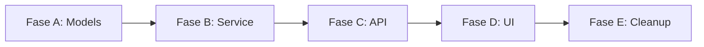

# QUICKSTART — Feature Grande (>400 LOC)

> **Cenário:** feature substancial — novo módulo, integração complexa,
> mudança que toca múltiplos sistemas. Vai ser dividida em fases.
>
> **Tempo:** 1-3 dias (em múltiplas sessões).
>
> **Pré-requisito:** SDD ativo, time alinhado com a feature, prazo realista.

---

## Quando é grande?

| Sintomas | Sinal |
|---|---|
| LOC estimado >400 | Quase certo grande |
| ≥4 arquivos novos | Quase certo grande |
| Múltiplas decisões arquiteturais | Grande |
| Mudança de schema DB | Grande (precisa migração) |
| Novo serviço externo + auth + persistência | Grande |
| "Vai precisar refatorar X primeiro" | Considere dividir em refator + feature |

---

## Diferença chave vs média: **multi-fase obrigatório**

Feature grande NUNCA é PR único. Sempre dividida em fases A/B/C/...:

```
Fase A: Foundation (modelos, infra básica) → PR isolado
Fase B: Core logic (regras de negócio) → PR isolado
Fase C: Integration (UI, API público) → PR isolado
Fase D: Migration / cleanup (se aplicável) → PR isolado
```

Cada fase: SPEC + PLAN + TASKS + IMPLEMENT + smoke + commit + **handover entre fases**.

---

## TL;DR (overview de toda a jornada)

```
SESSÃO 1 (planejamento, 1-2h):
  1. NEW_FEATURE modo "grande" → análise
  2. SPEC nova (ou v2 se evolução de existente)
  3. CLARIFY humano
  4. ADRs múltiplas (1 por trade-off)
  5. PLAN multi-fase → GATE 1 macro
  6. TASKS Fase A → GATE 2 (somente Fase A!)
  7. Handover de planejamento

SESSÃO 2 (Fase A, 4-8h):
  1. RESUME prompt
  2. IMPLEMENT Fase A
  3. Smoke + Commit + Handover Fase A

SESSÃO 3 (Fase B):
  1. RESUME prompt
  2. TASKS Fase B → GATE 2
  3. IMPLEMENT + Smoke + Commit + Handover Fase B

SESSÃO 4-N: idem para C/D/...
```

---

## Passo 1 — Sessão de planejamento

Cole `prompts/NEW_FEATURE.md`:

```
Quero adicionar a feature: <DESCRIÇÃO 2-3 frases>
Tamanho estimado: grande
Módulo afetado: <novo módulo ou múltiplos módulos>
Prazo desejado: <semana | sprint | sem prazo>

Especificamente: feature será multi-fase. Vamos planejar TUDO nesta sessão
mas implementar fase por fase em sessões separadas.
```

---

## Passo 2 — SPEC ampla

SPEC grande tem:
- §1 Objetivo: 1-2 parágrafos
- §3 Design: diagrama mermaid de arquitetura, fluxos sequenciais
- §4 Regras de negócio: tabela completa (não só lista)
- §5 Env vars: novas + alteradas
- §6 Arquivos: lista REALISTA (não subestimar)
- §7 Testes: matriz por fase (que cada fase testa)
- §8 DoD por fase
- §9 CLARIFY: pode ter 5-10 perguntas

⚠️ **Nunca apresse SPEC de feature grande.** Investir 1h aqui economiza 10h depois.

---

## Passo 3 — CLARIFY profundo

Para feature grande, CLARIFY pode ter perguntas tipo:

```
Q1: Quando usuário cancela mid-flight, devemos rollback ou pausar?
Q2: Limite de throughput: 100 req/s ou 1000 req/s?
Q3: Falha em fase X deve abortar fases Y/Z ou continuar?
Q4: Compliance LGPD aplica a esta feature? Como anonymizar?
Q5: Multi-tenancy considerado desde fase A ou só depois?
...
```

Responda **todas** antes de PLAN. Cada não-resposta vira uma pergunta no review.

---

## Passo 4 — ADRs múltiplas

Feature grande TIPICAMENTE gera 2-5 ADRs:
- ADR-NNN: choice de tecnologia X
- ADR-NNN+1: pattern arquitetural (event-driven? request-response?)
- ADR-NNN+2: estratégia de migração (se há mudança de schema)
- ADR-NNN+3: compliance/security trade-off
- ADR-NNN+4: observability strategy

Cada uma com:
- 2+ alternativas
- Prós/contras quantitativos quando possível (custo $, latência ms, complexity LOC)
- URL de fonte primária para cada alternativa
- Rollback plan concreto

⚠️ ADR de feature grande pode ter 200-500 LOC. Tá bom — vai ser referenciado por anos.

---

## Passo 5 — PLAN multi-fase

Tabela de fases obrigatória:

```markdown
## Fases

| Fase | Objetivo | LOC est. | PR # | Dependências | Risco |
|---|---|---|---|---|---|
| A | Models + DB schema | ~150 | #N | - | Médio (migração) |
| B | Service layer | ~200 | #N+1 | Fase A | Baixo |
| C | API endpoints | ~150 | #N+2 | Fase B | Baixo |
| D | UI integration | ~250 | #N+3 | Fase C | Alto (UX) |
| E | Cleanup/cutover | ~100 | #N+4 | Fase D | Crítico (rollback) |
```

Mapa de dependências (mermaid):


Riscos com mitigação por fase.

🛑 **GATE 1 macro** — você aprova o PLAN INTEIRO antes de começar qualquer fase.

---

## Passo 6 — TASKS apenas da Fase A

Para feature grande, **NÃO gere TASKS de todas as fases de uma vez.** Por quê:
- TASKS de Fase D depende de aprendizados de Fase A/B/C
- Vai mudar; geração antecipada vira waste

Gere TASKS apenas da Fase A:

```
specs/plans/TASKS_<FEATURE>.md

## Fase A — Models + DB Schema

T-A1: criar migration de schema
T-A2: criar modelo SQLAlchemy/Pydantic
T-A3: testes unit dos modelos
T-A4: pytest+lint+coverage full
T-A5: smoke (migration aplicada em staging real)
T-A6: commit "feat(<modulo>): models for <feature> [Fase A/E]"
```

🛑 **GATE 2 (Fase A)** — você aprova.

---

## Passo 7 — Handover de planejamento

Termina sessão de planejamento. Use `prompts/HANDOVER.md`:

- Nome: `handover_<FEATURE>_PLANNING_<DATA>.md`
- Inclui: SPEC link, ADRs links, PLAN link, TASKS Fase A link
- §"Próximos passos": "Sessão 2 implementa Fase A usando RESUME prompt"

Commit dos artefatos de docs:
```bash
git add specs/ docs/
git commit -m "docs(<feature>): SPEC + 5 ADRs + PLAN multi-fase + TASKS Fase A"
```

---

## Passo 8 — Sessão 2 (Fase A)

Use `prompts/RESUME.md` preenchido:

```
Retomar <PROJETO> — iniciar SPEC_<FEATURE> Fase A (Models + DB Schema).

LEIA NESTA ORDEM antes de qualquer ação:
1. AGENTS.md
2. instruções opcionais de tooling adotadas pelo projeto
3. docs/handover_<FEATURE>_PLANNING_<DATA>.md
4. specs/SPEC_INDEX.md
5. specs/modules/SPEC_<FEATURE>.md §1-§3 (objetivo + design)
6. specs/decisions/ADR-NNN.md (todas as ADRs aplicáveis a Fase A)
7. specs/plans/PLAN_<FEATURE>.md §"Fase A"
8. specs/plans/TASKS_<FEATURE>.md §"Fase A" (T-A1..T-A6)

GATEs aprovados: G1=sim, G2=sim para Fase A. G3/G4 não.
Próxima tarefa: T-A1.

Comece T-A1 conforme .agent/workflows/sdd_implement.md.
Pare ao fim de cada tarefa para meu GO.
```

Implementa Fase A inteira. Smoke staging. Commit. Handover Fase A.

---

## Passo 9 — Sessão 3 (Fase B)

Antes de começar Fase B:
1. Cole RESUME apontando para handover_<FEATURE>_FASE_A_<DATA>.md
2. Agente confirma estado (Fase A merged em main? smoke OK em prod?)
3. Gere TASKS Fase B (não estavam prontas)
4. GATE 2 Fase B
5. IMPLEMENT Fase B
6. Smoke + Commit + Handover Fase B

Repita para C/D/E.

---

## Passo 10 — Cutover (Fase final, se há)

Se feature substituiu funcionalidade existente (refator + feat):
- Fase final é **cutover** — remover código antigo
- Smoke EXTRA: 100% tráfego no novo, monitorar 24-48h
- Rollback plan documentado e testado

Use `prompts/REFACTOR.md` para a fase de cutover (não NEW_FEATURE — é remoção).

---

## Anti-padrões em feature grande

| Anti-padrão | Por quê é catastrófico |
|---|---|
| PR único de 1500 LOC | Revisor desiste; bugs escapam | 
| Pular CLARIFY profundo | 50% das decisões viram retrabalho |
| Gerar TASKS de todas as fases de uma vez | TASKS Fase D vira ficção; refeita depois |
| Sem ADR de migração | Cutover fica sem plano de rollback |
| "Big bang" em produção (sem fases) | 1 falha = sistema inteiro down |
| Sem handover entre fases | Perda de contexto entre sessões |
| Mesma sessão para Fase A + B | Sessão de 8h+ = qualidade despenca |

---

## Critérios de pronto (por fase)

Cada fase tem critérios próprios:

- [ ] TASKS da fase ✔️ APROVADAS
- [ ] Todas as tarefas da fase implementadas
- [ ] Pytest+lint+coverage 0 falhas
- [ ] Smoke staging OK
- [ ] Commit Conventional `feat(<modulo>): <fase> [Fase X/Y]`
- [ ] PR ≤300 LOC por fase (cada PR isolado e revisável)
- [ ] Handover entre fases criado
- [ ] SPEC_INDEX.md atualizado por fase

## Critérios de pronto (feature inteira)

- [ ] Todas as fases ✔️ APROVADAS
- [ ] SPEC ✔️ IMPLEMENTADA
- [ ] Todas ADRs ✔️ ACEITAS
- [ ] Cutover (se houver) testado em staging com rollback validado
- [ ] Documentação de usuário/API atualizada
- [ ] Métricas de sucesso (do brief) sendo medidas

---

## Quando dividir em sub-features

Se a "feature grande" passa de 5 fases:
- Considere se NÃO é 2+ features separadas
- 8 fases sequenciais é inviável (vai pausar 2 meses, contexto perdido)
- Quebrar em "MVP" + "v2" + "v3" é melhor

---

*Veja: `prompts/NEW_FEATURE.md`, `prompts/RESUME.md`, `prompts/HANDOVER.md`, `QUICKSTART/refactor.md` para fases de cutover.*
