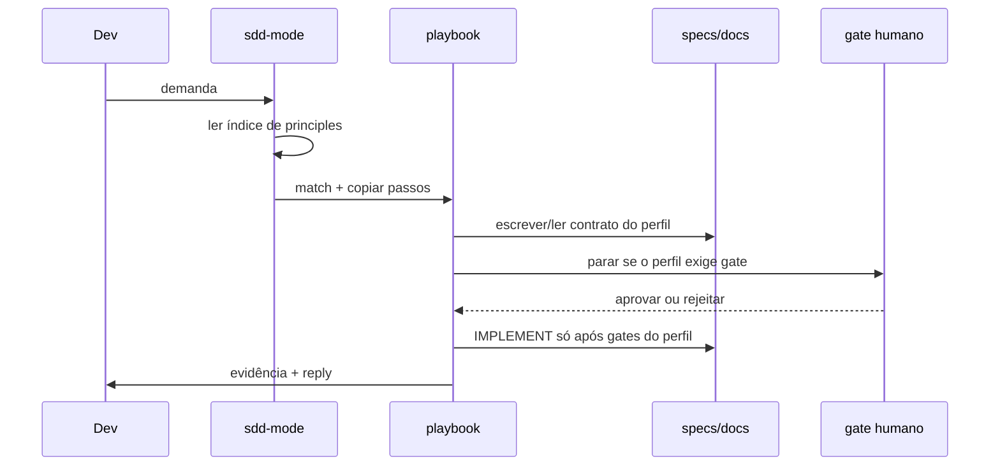

# SPEC_SDD_MODE — Skill de modo SDD (roteador + playbooks + principles)

**Status:** ✔️ CONCLUÍDO
**Autor(es):** Allan + Grok
**Data de criação:** 2026-08-25
**Última atualização:** 2026-08-25
**Spec relacionadas:** `SDD/decisions/ADR-001-skill-as-interface.md`, `SDD/decisions/ADR-002-gate-profiles.md`

---

## 1. Objetivo

Dar ao desenvolvedor um ponto de entrada único (`sdd-mode`) que aplica Spec-Driven Development em todos os cenários do starter, com o mesmo formato operacional do pstack (modo sticky, playbooks verbatim, principles invocáveis), sem tornar o método dependente de uma IDE ou de autonomia que pule gates.

---

## 2. Contexto e Justificativa

- **Architecture:** o starter não tem `SDD/architecture.md` preenchido; a visão canônica do método é `.agent/skills/sdd-mode/references/workflow.md`.
- **Problema:** hoje o procedimento vive em `sdd-mode playbooks (see .agent/skills/sdd-mode/playbooks/)`, `QUICKSTART/` e `.agent/workflows/` ao mesmo tempo. O agente resume e inventa um plano que pula GATE. O pstack resolve isso copiando passos verbatim; o SDD ainda não tem essa peça.
- **ADRs aplicáveis:** ADR-001 (skill, não plugin, como interface), ADR-002 (perfis de gate).
- **Constraints:** tool-neutrality (`PLAN_SDD_CORE_NEUTRALITY`); as 6 regras absolutas de `AGENTS.md`; templates de artefato continuam a fonte do *o quê* persistido.
- **Fonte do formato:** https://github.com/cursor/plugins/blob/main/pstack/README.md
- **Fonte do método:** `.agent/skills/sdd-mode/references/workflow.md` e https://codelabs.developers.google.com/sdd-adk-antigravity

---

## 3. Design Técnico

### 3.1 Estruturas de dados

Camadas (uma casa por fato):

| Camada | Casa | Papel |
|---|---|---|
| Método | `.agent/skills/sdd-mode/references/workflow.md` | o quê / por quê / quando |
| Procedimento | `.agent/skills/sdd-mode/` | como executar agora |
| Contrato persistido | `specs/`, `docs/` templates | o que a skill escreve |
| Ponte humana | `sdd-mode playbooks (see .agent/skills/sdd-mode/playbooks/)`, `QUICKSTART/` | apontam o playbook; não donos dos passos |

A skill `sdd-mode` casa a demanda a um playbook, copia os passos para o todo, dispara principles/skills nomeadas, e **para** no gate do perfil. Skip só com `skip: motivo`.

Perfis de gate: `observe` | `design` | `lite` | `standard` | `full`. Definição em ADR-002 e `SDD_WORKFLOW.md` §2.

### 3.2 Sequence diagram

### 3.3 Fluxos críticos

1. **Feature média:** match `feature.md` → perfil `full` → SPEC/CLARIFY/ADR → PLAN → GATE 1 → TASKS → GATE 2 → TDD IMPLEMENT → G3 → G4 → handover.
2. **Bug simples:** match `bug-fix.md` → perfil `lite` → repro → causa raiz → RED-GREEN → G3 no mesmo repro → G4.
3. **Design sem código:** match `design.md` → perfil `design` → `SDD/design/<slug>.md` → aprovação humana → sem código de produção.
4. **User story:** match `user-story.md` → exige SPEC de módulo existente → Given/When/Then → perfil `standard` ou `lite` → TDD → G3/G4.

---

## 4. Regras de Negócio

| ID | Regra | Fonte |
|---|---|---|
| RN-SDD_MODE-01 | Código de produção só após o contrato do playbook (SPEC, story, ou “nenhum” em bug) | `AGENTS.md` regra 1; principle-spec-first |
| RN-SDD_MODE-02 | O playbook declara o perfil de gate; o agente não escolhe `lite` para pular PLAN em feature média | ADR-002 |
| RN-SDD_MODE-03 | Skip de passo só com `skip: motivo` no todo | pstack poteto-mode (mecanismo) |
| RN-SDD_MODE-04 | Parar no gate do perfil; não perguntar permissão dentro de TASK já aprovada | principle-stop-at-gate |
| RN-SDD_MODE-05 | Módulo novo não nasce só de user story | esta SPEC §3.3 |
| RN-SDD_MODE-06 | TDD RED-GREEN é default quando o teste local for barato; skip com motivo; G3 permanece nos perfis que geram código | principle-tdd-red-green |
| RN-SDD_MODE-07 | Skill canônica vive em `.agent/skills/`; plugin/IDE só em `tooling/` | ADR-001; PLAN_SDD_CORE_NEUTRALITY |
| RN-SDD_MODE-08 | Não copiar “best spec is code” nem “never block on the human” como default | ADR-001 |
| RN-SDD_MODE-09 | `sdd-mode playbooks (see .agent/skills/sdd-mode/playbooks/)` e `QUICKSTART/` não donos de passos após a fase 3 | principle-one-home-per-fact |

---

## 5. Variáveis de Ambiente

Nenhuma. A skill não lê secrets nem escolhe stack.

---

## 6. Arquivos a Criar/Modificar

### Arquivos novos

| Caminho | Função |
|---|---|
| `.agent/skills/sdd-mode/SKILL.md` | Roteador sticky |
| `.agent/skills/sdd-mode/playbooks/*.md` | Passos por cenário |
| `.agent/skills/principle-*/SKILL.md` | Uma regra cada |
| `.agent/skills/sdd-tdd/SKILL.md` | Loop RED-GREEN |
| `.agent/skills/sdd-mode/templates/` | Fontes copiadas para `SDD/` |
| `SDD/` | Processo gerado do produto |

### Arquivos modificados

| Caminho | Mudança |
|---|---|
| `.agent/skills/sdd-mode/SKILL.md` | Preamble cria `SDD/` |
| `README.md` | Skill pack; sem docs paralelos |
| `SDD/INDEX.md` | Este módulo + ADRs |

---

## 7. Testes Requeridos

Não há runtime. Verificação por consistência documental.

| ID | Tipo | Cobertura | AC |
|---|---|---|---|
| T-SDD_MODE-01 | review | cada playbook declara perfil | grep `Gate profile` em `playbooks/` |
| T-SDD_MODE-02 | review | playbooks escrevem só em `SDD/` | nenhum path `specs/` ou `prompts/` nos playbooks |
| T-SDD_MODE-03 | review | uma casa por fato | processo em `SDD/`; procedimento na skill |
| T-SDD_MODE-04 | review | anti-pstack | skill não recomenda never-block / merge overnight |

---

## 8. Critérios de Aceite (DoD)

- [ ] `sdd-mode` casa todos os cenários atuais (bootstrap, discover, bug, feature, refactor, resume, handover, onboarding)
- [ ] Playbooks novos: investigation, design, prototype, user-story, tdd-implement, multi-phase
- [ ] Principles absolutas + proportional-rigor, stop-at-gate, prove-it-works, tdd-red-green, sequence-verifiable-units, one-home-per-fact
- [ ] Perfis de gate documentados no workflow e declarados em cada playbook
- [ ] Templates de story e design existem
- [ ] Prompts/quickstarts apontam playbooks (fase 3)
- [ ] Tool-neutrality preservada: sem plugin como core
- [ ] SPEC_INDEX e ADRs atualizados

---

## 9. CLARIFY — perguntas abertas

Nenhuma. Decisões em ADR-001 e ADR-002.

---

## 10. Histórico

- 2026-08-25: SPEC criada a partir do plano aprovado (skill de modo, formato pstack, método SDD).
