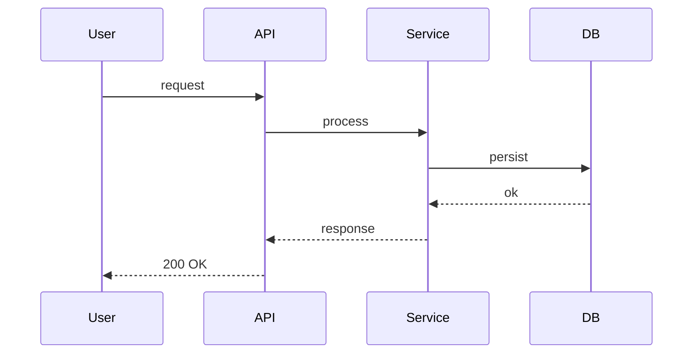

<!--
═══════════════════════════════════════════════════════════════════════════════
  Template de SPEC (Specification) de módulo
═══════════════════════════════════════════════════════════════════════════════

  Como usar:
  1. Copie este arquivo para specs/modules/SPEC_<MODULO>.md
  2. Substitua <MODULO> pelo nome em UPPER_SNAKE_CASE (ex.: AUTH, SESSIONS, BILLING)
  3. Preencha cada seção. Não pule. Não condense — outras pessoas vão ler.
  4. Para perguntas que você não consegue responder agora: liste em §9 (CLARIFY).
  5. Status inicial: 📝 RASCUNHO. Promova ao longo do ciclo (ver SDD_WORKFLOW §4.2).

  Para SPECs grandes (>800 LOC estimado, >5 arquivos novos):
  - Crie também specs/plans/PLAN_<MODULO>.md (multi-fase)
  - Veja SDD_WORKFLOW §13 (SPECs Multi-Fase)
═══════════════════════════════════════════════════════════════════════════════
-->

# SPEC_<MODULO> — <Frase descrevendo o módulo>

**Status:** 📝 RASCUNHO
**Autor(es):** <nomes>
**Data de criação:** YYYY-MM-DD
**Última atualização:** YYYY-MM-DD
**Spec relacionadas:** `specs/modules/SPEC_<X>.md`, `specs/decisions/ADR-NNN-*.md`

---

## 1. Objetivo

> Frase única descrevendo o "porquê" deste módulo. Não o "como".

<!-- Exemplo:
"Permitir que usuários autentiquem via Google OAuth, mantendo sessão por 30 dias
sem necessidade de re-login, garantindo conformidade com OAuth 2.1."
-->

---

## 2. Contexto e Justificativa

> Por que este módulo existe? Quais documentos / regulamentações / ADRs motivam?

<!-- Mínimo:
- Referência ao Architecture document: docs/<Project>_Architecture.md §X
- Regulamentação aplicável (LGPD/GDPR/HIPAA/PCI-DSS) com URL
- ADRs aceitos que afetam este módulo
- Constraints externas (vendor lock-in, SLA contratual, budget)
-->

- **Architecture:** `docs/<Project>_Architecture.md` §<seção>
- **Compliance:** <URL regulamentação aplicável>
- **ADRs aplicáveis:** ADR-NNN, ADR-MMM
- **Constraints:** <lista>

---

## 3. Design Técnico

### 3.1 Estruturas de dados

```
<dataclass / type / interface / schema do banco>
```

### 3.2 Sequence diagram (mermaid)



### 3.3 Fluxos críticos

> Liste 2-3 fluxos end-to-end que o módulo precisa suportar.

1. <Fluxo 1>: descrição passo-a-passo
2. <Fluxo 2>
3. <Fluxo 3>

---

## 4. Regras de Negócio

> Cada regra tem ID estável (RN-<MODULO>-NN), enunciado e fonte verificável.

| ID | Regra | Fonte |
|---|---|---|
| RN-<MODULO>-01 | <enunciado> | <URL ou doc interno> |
| RN-<MODULO>-02 | <enunciado> | <URL> |

---

## 5. Variáveis de Ambiente

> Toda variável que o módulo lê. Documentar default e por que existe.

| Nome | Default | Descrição | Obrigatória? |
|---|---|---|---|
| `<MODULO>_API_KEY` | — | Chave de API do serviço externo | Sim |
| `<MODULO>_TIMEOUT_MS` | `5000` | Timeout de chamadas externas | Não |

---

## 6. Arquivos a Criar/Modificar

> Lista exaustiva. Caminho completo + função esperada. Ajuda a estimar LOC.

### Arquivos novos
| Caminho | Função | LOC est. |
|---|---|---|
| `app/<modulo>/__init__.py` | Exports públicos do módulo | 5 |
| `app/<modulo>/service.py` | Lógica principal | 80 |
| `app/<modulo>/models.py` | Dataclasses / schemas | 30 |
| `app/api/<modulo>.py` | Endpoints HTTP | 50 |

### Arquivos modificados
| Caminho | Mudança | LOC est. |
|---|---|---|
| `app/main.py` | Registrar router | 3 |
| `requirements.txt` | Adicionar dep `xyz` | 1 |

**Total estimado:** <X> LOC novos + <Y> LOC modificados.

---

## 7. Testes Requeridos

> Cobertura mínima por função/fluxo. AC verificável.

| ID | Tipo | Cobertura | AC |
|---|---|---|---|
| T-<MODULO>-01 | unit | `service.<funcao>` happy path | retorna X dado Y |
| T-<MODULO>-02 | unit | `service.<funcao>` erro de validação | levanta `ValueError` |
| T-<MODULO>-03 | integration | fluxo end-to-end #1 | response 200 + DB tem registro |
| T-<MODULO>-04 | smoke | login real em staging | usuário logado em <5s |

**Cobertura mínima:** ≥80% das funções da §6.

---

## 8. Critérios de Aceite (Definition of Done)

> Lista checável. Cada item é verificável (comando, teste, observação).

- [ ] Todos os arquivos da §6 criados/modificados
- [ ] Todos os testes da §7 passam
- [ ] Cobertura ≥80% (medida por `pytest --cov` ou equivalente)
- [ ] Lint sem erros (mypy/pyright/eslint/golangci-lint)
- [ ] Smoke tests verdes em staging (≥2 fluxos críticos)
- [ ] Logs estruturados (sem `print()`)
- [ ] Type hints / Types em 100% das funções públicas
- [ ] Docstrings em funções exportadas
- [ ] AGENTS.md atualizado se nova regra absoluta surgiu
- [ ] SPEC_INDEX.md atualizado com status do módulo
- [ ] Handover gerado (`docs/handover_<MODULO>_<DATA>.md`)

---

## 9. CLARIFY — Perguntas Abertas

> Liste perguntas que precisam ser respondidas por humano antes de avançar
> para PLAN. Conforme respondidas, mover para §10 (Histórico) e remover daqui.

- **Q1:** <pergunta clara, com 2-3 opções viáveis se aplicável>
- **Q2:** <pergunta>
- **Q3:** <pergunta>

> Quando esta seção ficar **vazia**, promover status para 📋 PLAN e gerar
> `specs/plans/PLAN_<MODULO>.md`.

---

## 10. Histórico de Decisões

> Decisões importantes durante CLARIFY. Cada uma vira potencialmente uma ADR.

| Data | Decisão | Rationale | ADR? |
|---|---|---|---|
| YYYY-MM-DD | <decisão> | <por quê> | ADR-NNN |

---

*Manter sincronizado com `specs/SPEC_INDEX.md`.*
