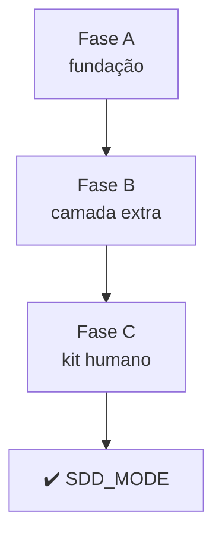

# PLAN_SDD_MODE — Skill de modo SDD

**Status:** ✅ APROVADO (plano de sessão; implementação em 3 fases reversíveis)
**Autor:** Allan + Grok
**Data:** 2026-08-25
**Spec base:** `specs/modules/SPEC_SDD_MODE.md`
**ADRs aplicáveis:** ADR-001, ADR-002

---

## Resumo Executivo

Introduzir `sdd-mode` como interface do starter: roteador sticky, playbooks verbatim, principles como skills curtas. Copiar o mecanismo do pstack, não a filosofia anti-planning.

Três fases. Cada uma deixa o kit utilizável. Fase 1 cobre os cenários que já existem. Fase 2 acrescenta design, story, TDD, investigation, prototype. Fase 3 faz prompts/quickstarts apontarem os playbooks (uma casa por fato).

Premissa: o repo continua template. A skill vive em `.agent/skills/`. Plugin Cursor não entra no core.

---

## Tabela de Fases

| Fase | Entrega | Risco | Gate de aceite |
|---|---|---|---|
| **A** | SPEC/ADRs + sdd-mode + principles base + playbooks atuais + §2 do workflow | Médio | Agente que lê só `sdd-mode` cobre bug/feature/refactor/bootstrap/discover |
| **B** | TDD, design, story, investigation, prototype, multi-phase + templates | Médio | Design sem código; story com menos gates; IMPLEMENT em RED-GREEN |
| **C** | Prompts/QUICKSTART/FILE_GUIDE/README/AGENTS/tooling como ponteiros | Baixo | Nenhum passo canônico duplicado em `prompts/` |

---

## Mapa de Dependências

---

## Detalhe por Fase

### Fase A — Fundação

**Objetivo:** o modo existe e cobre o que o starter já cobria.

**Arquivos:** `sdd-mode/SKILL.md`, principles absolutas + proportional-rigor + stop-at-gate + prove-it-works, playbooks bootstrap/discover/bug-fix/feature/refactor/resume/handover/onboarding, `SDD_WORKFLOW.md` §2.

**Pré-condições:** ADR-001 e ADR-002 aceitos.

**Não faz:** apagar texto dos prompts; playbooks novos.

### Fase B — Camada extra

**Objetivo:** possibilidades além de bug/feature/refactor.

**Arquivos:** `sdd-tdd`, principles TDD/sequence/one-home, playbooks investigation/design/prototype/user-story/tdd-implement/multi-phase, templates story e design. Ligar TDD nos playbooks de implementação da fase A.

### Fase C — Reorganizar o kit humano

**Objetivo:** uma casa por fato.

**Arquivos:** prompts, QUICKSTART, workflows, FILE_GUIDE, README, AGENTS, tooling/cursor, specs/README.

---

## Fora de escopo

Plugin como artefato principal; playbooks pstack de autopilot/overnight/visual-parity/forensics; escolha de stack.

---

## Critérios de aceite

Os da SPEC_SDD_MODE §8, verificáveis por leitura (T-SDD_MODE-01..04).
